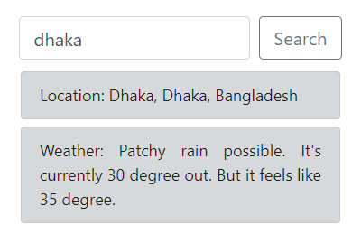
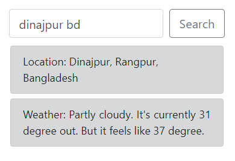
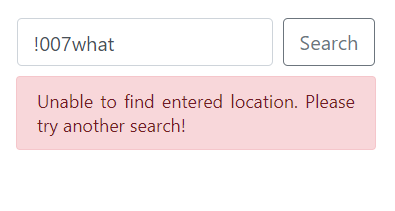

# Weather App

This is a Single Page App.<br/>
Just input location into search bar and hit enter for weather information of that area.<br/>

It was made using Node.js and Express.js<br/>
For frontend, I've used vanilla JS to fetch JSON data from backend.<br/>
The UI was designed with CSS and BootStrap.<br/>

The idea was very simple.<br/>
I have used two API to get weather data.<br/>

Input location from user and pass it to "Mapbox API".<br/>
Mapbox API return location data includes latitude and longitude.<br/>
Then, passing Geo Coordinates into "WeatherStack API" and then finally it returns weather data.

## Screenshots

### App UI


### Search locaiton



### Specific location for deeper search



### Blank input error handling


### Wrong location name error handling



### 404 Page not found!


## Requirments

```
Node.js 12+
npm 6+
```

## Installation

If you want to test my project or do whatever you want, here's a little guide:

### Cloning Repository

First clone this repository using git clone into your local machine:

```
$ git clone https://github.com/rsupanta/weather-app.git
```

Or you can download as zip file using github.

### Setting up Project Environment

Navigate into project directiory.<br/>
Run command to install all dependencies:

```
$ npm install
```

The packages are going to install:

```
Express.js: 4.17.1
hbs: 4.1.1
postman-request: 2.88.1
```

### Modifying API keys

You need API secret keys from "MapBox" and "WeatherStack".<br/>
Both API offers free option.<br/>

Navigate into "src\utils"<br/>
Open "forecast.js" and "geocode.js"<br/>
Replace 2nd line of both files with your API key<br/>

Example:

```
const apiKey = require("./forecastKey");
const apiKey = require("./geoKey");
```

Replace this lines with,

```
const apiKey = "Your API Key"
```

### The Final Step

Navigate into /src and run command-<br/>

```
$ node app.js
```

It will show server running status.<br/>

You can access the app by visiting

```
http://localhost:3000/
```

### Thanks for your time.
